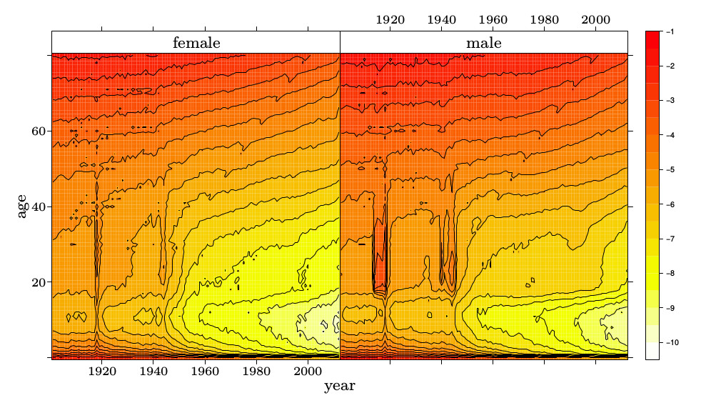
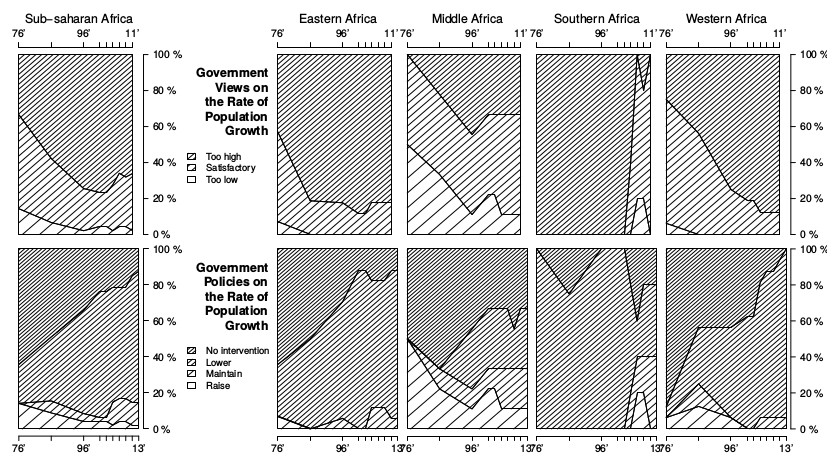
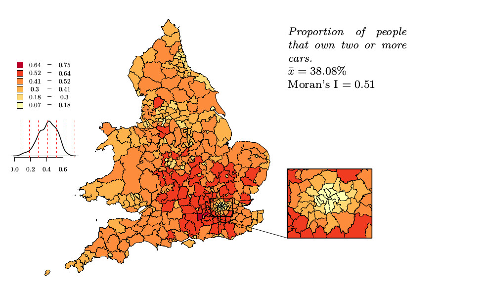
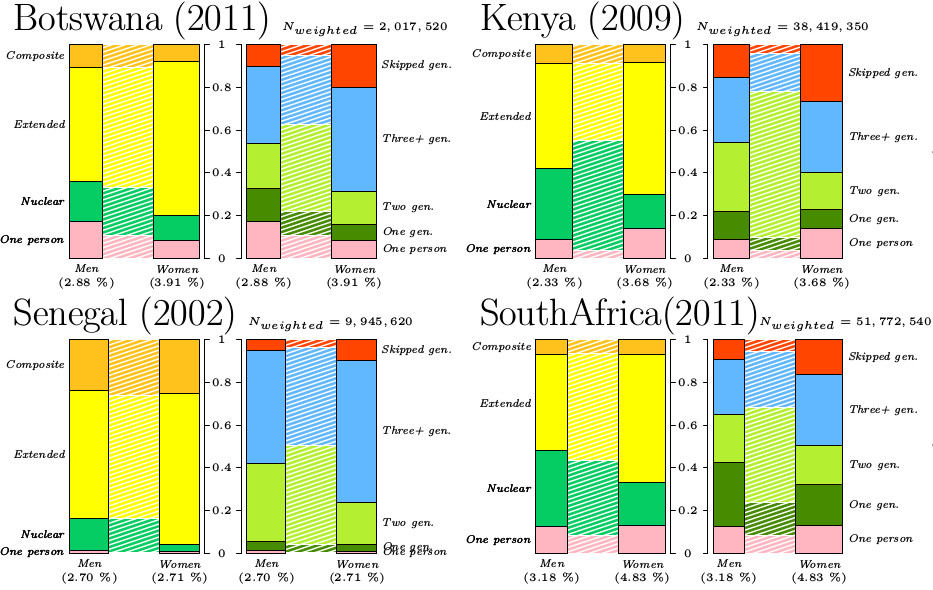
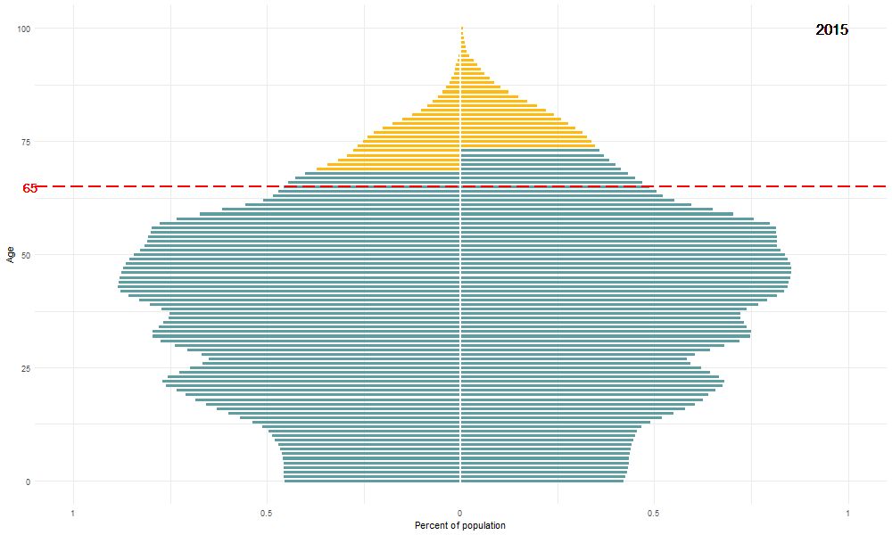
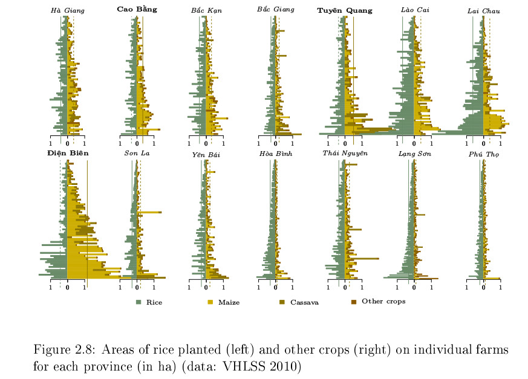

# Outline

* What exactly is R and why do we use it?

* Data visualisation and interactivity in R

* The Rstudio way of interfacing with R 

* The R language simplified

* A demonstration of how to create a regression model using R

---

#  What exactly is R and why do we use it?

--

`1.`  R is a programming language

???
R is two things: language for statistical computing. an actual programming language. This can be a bit scary at first, but trust me, it's worth it.  

--

`2.`  R is an environment for data analysis 

???
Because R is also complete environment for data analysis, a comprehensive platform for data management, data exploration, data analysis and data visualisation as well as reporting and presenting your analysis. 

--

R is one of the most popular platforms for data analysis, with an expanding user base as well as ever expanding functionality.

???
R is currently one of the most popular platforms for data analysis, with an expanding user base as well as ever expanding functionality.
--

So is it worth learning?

???

So is it worth learning?

Like learning anything new, learning R takes a bit of effort. But you do not need to be a computer scientist to use R, I'm definitely not :)

Now although we don't have a lot of time today, I will try to give you a flavour of why you might want to take the plunge and learn R. 


---
#  What exactly is R and why do we use it?


???
So is it worth learning  In a way I guess it depends on what your alternative is. If it is another statistical software package, then you want to be careful if it is a commercial package. 

That means you are tied to licences, that can be very expensive.  With R you are no longer dependent on this. 

--

* R is free, open source and available on all three major platforms.

???


Because R is opensource and free, and available on Windows, Mac and Linux. 

That means you can change employers, universities, operating systems and not worry about being able to continue your work. 

You will also be able to import data in a number of proprietary formats, including Excel, SPSS, STATA and others. 

You can also interface with python, julia, netlogo, Matlab, or any number of analytical tools you can think of if you want to harness the best of both worlds. 

---
#  What exactly is R and why do we use it?

* R is free, open source and available on all three major platforms.

* Countless extensions (packages) and interfaces with other programmes

???
One of the advantages of R being open source is that anyone can contribute to its development. Of course it would quickly become unwieldy if downloading R meant also downloading everyone else contributions.  

But you don't have to, Instead you only download a base version of R and then you can supplement this installation by loading additional packages as and when required. These packages are extensions that have been written by other users and made available for free. 

Packages contain functions and or datasets that are not available in the base instillation. 

The official repository for packages is called CRAN and all packages, almost 14,000 of them, are fully documented with standard format help files. 


---
#  What exactly is R and why do we use it?

* R is free, open source and available on all three major platforms.

* Countless extensions (packages) and interfaces with other programmes

* Great community 

???
This is one of my favourite parts of the R ecosystem, community that comes along with it. More often than not, a problem that you are trying to solve was already attempted by someone else and you can 

* easily access their code, 
* and use their functions directly, 
* or use their code as a template to tweak according to your needs. 
* You can even contact the authors themselves and suggest some function that their package is missing and they might want to add.

The R community takes various shapes and forms, you can find helpful folk on dedicated forums and  community websites, mailing lists and even by following the #rstats on twitter.  

---
#  What exactly is R and why do we use it?

* R is free, open source and available on all three major platforms.

* Countless extensions (packages) and interfaces with other programmes

* Great community 

* Making reproducible research the norm

???
I want to quickly mention reproducibility and the importance of scripting.

Many data analysis and data visualisation tools rely on point and click actions. 

This can be great, especially if you want to do something quick and dirty, but such work is not reproducible. It is also prone to error as anyone who has tried to highlight a few columns of cells in Excel knows. 

Instead using scripts, or code, to conduct your analysis, means that everything from importing the data, exploring it, running the analysis, creating the visualisations, and preparing the reports, presentations or papers is recorded

It means you can rerun the analysis simply, you are transparent about the exact steps you took, to your collaborators, your peers, and most importantly, to yourself. 

---
#  What exactly is R and why do we use it?

* R is free, open source and available on all three major platforms.

* Countless extensions (packages) and interfaces with other programmes

* Great community 

* Making reproducible research the norm

* Excellent data visualisation capabilities

???
Finally, data visualisation. R has i have to say spectacular data visualisation capabilities. I won't talk too much about this, really, I though I'd just show you a few random examples of things I've done with R graphics, to give you a flavour

---
# Dataviz examples
### Lexis maps - Death rates 14 European countries 

```{r echo = FALSE}

```

???
So here's an example of a heat map, this is pretty much out of the box, looking at death rates in 14 European countries that have data going back to 1900. I like this chart because it is so simple but tells so many stories when you look at it a bit more closely. Like you can see the first world war ad the second, 

You can see the impact they had on civilians, by looking at the difference between women and men. You can also see this really unusual line here, this blip of low mortality of people who were born in 1918, which is when the Spanish flu epidemic was raging. 
---
# Dataviz examples
### Lexis maps - Population policy in Sub-saharan Africa

```{r echo = FALSE}

```

???
Here's a more bespoke example, this is African governments views on population growth and policies. I made this for a publication that needed to be printed in black and white.

It shows how the views have changed over time on the continent as a whole and in regions separately. For example most of Southern African countries now think their population growth rates are satisfactory, or even too low, while the rest of the continent is slowly moving towards seeing their growth rates as being too high. 

---
# Dataviz examples
### Local Autocorrelation--UK census 2001

```{r echo = FALSE}

```

???
You can also do spatial analysis in R, and all sorts of mapping. This is data from the UK census, a chloroplast map of the proportion of households in each area that own more than two cars. 

This is a more complex layout, which includes a zoom in into the London area, and this little neat density curve under the legend, giving you an idea of the overall distribution.


---
# Dataviz examples
### Stacked bar charts: Household living arrangements of older people

```{r, echo = FALSE, out.width = "700px"}

```
???

And here is a more elaborate bar chart I did on household living arrangements of older people in a few African countries. So these are people over 60 living in different types of households, such as single generation or multiple generation. You can compare men and women, but in the background I've also added the country average for comparison. 


---
# Dataviz examples--animation
### Korea: Population pyramid

```{r echo = FALSE}
knitr::include_graphics("figures/pyramid_65_Republic_of_Korea_1980-2015.gif")
```

???
You can also make animated charts in R, and save them as gifs. Because I'm a demographer I have a soft spot for population pyramids, so here's one of Korea's population growing older, you can see the year changing up in the corner there. 

This is perhaps not super useful from a scientific point of view, but anyone who has used twitter knows how a good gif can attract much more attention than a link to a pdf publication.. So it's not a bad skill to acquire :)

---
# Dataviz examples--animation
### Korea: Population pyramid

```{r echo = FALSE}

```
---
# Dataviz examples--interactivity

```{r, echo = FALSE, out.width = "700px"}

```
[Interactive datavis solution using `shiny` in R](https://maja.shinyapps.io/VHLSS/)

???
And finally I wanted to show you an example of interactive data visualisation, this is an example of a chart I did of the farm sizes of Vietnamese households in a farming survey, and there's quite a lot going on here, and maybe a bit difficult to compare the different provinces, there's fourteen here. 

So I turned this chart into an interactive one using shiny, which is an r package for creating interactive visualisations.
 This was actually the first interactive biz i made. So let's see if I can get it up and running.


---

# Dataviz examples-galleries

[https://www.r-graph-gallery.com/](https://www.r-graph-gallery.com/)


[https://shiny.rstudio.com/gallery/](https://shiny.rstudio.com/gallery/)

---

# Rstudio


* Difference between plain old R and Rstudio.

???
Just to clarify a bit of terminology, you should be able to distinguish between R and RStudio. R is the programming language and the suite of software facilities for data analysis and visualisation. Once you've installed R you can use it from a rather basic console. 

However you will find interacting with R a lot easier and more familiar if you use RStudio, which is an IDE or integrated development environment for using R. There have been several other IDEs for R over the years, and in fact you can also use R in other environments such as emacs or vim if you prefer. 

But Rstudio has become quite a leader in the field and integrates many functions that make using R much easier and enhancing your workflow, and is super user friendly with a great community. 

It makes it particularly easy to do everyday tasks, as well as things like creating interactive visualisations like I showed you, or directly writing reports, presentations and papers, and I'll get back to that at the end of the presentation.

--

* Rstudio layout:
  + console---command window
  + script window---editor
  + workspace & history window + more
  + files, plots, packages, help + more

???
Now however it is time to switch gear, and have a look at R in practice. So let me show you the Rstudio layout, well, by actually showing you the Rstudio layout. 
---
# Rstudio

???
So this is a fresh install of both R and Rstudio on a Windows machine. 

OK, we'll start in the left, this is the console, or the command window. 

This little 'greater than' sign is the prompt where you can type in commands and where R executes them. 

A quick example 

In practice you will actually want to avoid typing directly into the console, because typing into the console is not reproducible. You want to be able to rerun your code in a way that it executes the same way, so instead we type code into a script file. 

I will open a new scripting file, which fits in the fourth panel on the top left here. So now I can type in some code into the scripting file, and run it from there. I can do this by highlighting it and clicking the run button, or by using the keyboard short cut Ctrl+enter. In fact I don't even need to highlight it, it's enough that I have the cursor placed inside a command and it will be executed, even if it spans several rows. 

Let's have a quick look at the other panes as well.. 

---
# The R language simplified
## variable assignment
```{r}
height <- 11
width <- 5
height
width
area <- height * width
area 
```

???
So I now want to very quickly go through a few basics of the R language, just to make you a bit more familiar, and to show you it's not tricky at all. 

So the first thing to understand is the assignment of variables. The assignment operator in R is this combination of symbols, smaller than and dash, or hyphen. 


---
# The R language simplified

### vectors and data types 

```{r}
# numeric vectors
vec1 <- c(20, 33, 41, 22, 12)
# string  vectors
vec3 <- c("Maja", "Michael", "Amy", "Nabila", "Taylor")
vec3
# logical vectors 
vec4 <- c(TRUE, FALSE, FALSE, TRUE, TRUE)
vec4

vec3[3]
```
???
Now you normally wouldn't be working with single numbers, but with variables, especially if you are a social scientist, you want a way to represent variables. 

In R you do that using vectors. And we have different types of vectors, most common ones are numeric, string and logical, so let's try a few of those. 

And you will notice that vectors have to be of the same type, you cannot mix data types in R!

---
# The R language simplified

### functions in base R
```{r}
mean(vec1)
```

???
Functions play an important role in R, we've already seen one, that was c(), but there are countless others. For example if we want to calculate the average of the vector1, we would use mean(vec1). 

Functions usually take arguments, here the mean function takes the argument the vector that we want to calculate the average of. Other functions can take many more arguments. 

For example the function rnorm takes three arguments, we can have a look at the help file to see that. 

In R you don't even have to name the arguments, if it is obvious what they are, because of the order in which you enter them. So in this example we don't have to write sd = 2, we can just write 2. 

You can get more functions by loading additional packages, but of course you can also write your own! But we don't have time for that today unfortunately, so let's press on. 

---
# The R language simplified
### data frames

```{r}
vec5 <- c(1981, 1974, 1993, 1957, 1971)

```

???
So as social scientists what we all really want is a table of data. In R tables are called data.frames. And they are simply a collection of vectors. 

You will remember I said before that vectors have to be of a single data type, numeric or string for example, now that makes sense, they are variables, and in a data.frame, they become the columns of the table. 

That means they also have to all be the same length. So let's create a data frame. 
---
# The R language simplified
### data frames

```{r}
vec5 <- c(1981, 1974, 1993, 1957, 1971)

my.df <- data.frame(year.born = vec5, 
                    name = vec3, 
                    rps = vec1,  
                    like.white.choc = vec4)
my.df

```

???
Now one last thing we need to know about dataframes is how to access a column in a dataframe. To do this we use the `$ `operator, so df$like.white.choc is how you access that column. 

SO let's use that to draw a quick plot. 

There, so that's just the shortest possible overview that should hopefully allow you to follow the next bit, which is a bit of regression analysis with an actual dataset.

So in order not to bore you too much with my slow typing, I've prepared the script for the regression analysis in advance, so I don't slow us down too much. 
---
# Linear Regression Modelling in R

```{r, echo = FALSE}
# load data
suppressMessages(library(gapminder))

# load other packages needed
library(ggplot2)
library(broom)
library(tidyverse)
```
---
# Linear Regression Modelling in R

```{r}
# inspect data
head(gapminder)
unique(gapminder$country)
min(gapminder$year)
```
---

# Linear Regression Modelling in R

```{r}
# plot data
ggplot(gapminder, aes(year, lifeExp)) +
  geom_point()  
```
---
# Linear Regression Modelling in R

```{r}
# fit model
reg1 <- lm(lifeExp ~ year, data = gapminder)
# inspect regression
tidy(reg1)
glance(reg1)
```

---
# Linear Regression Modelling in R

```{r, out.height = "450px"}
# plot regression1
ggplot(gapminder, aes(year, lifeExp)) +
  geom_point() + 
  geom_jitter(width = 1) +
  geom_smooth(se = FALSE, method = "lm") 
```

---
# Bivariate regression 2

```{r}
# bivariate regression 2 ######################################################
reg2 <- lm(lifeExp ~ gdpPercap, data = gapminder)
tidy(reg2)
glance(reg2)
```

---
# Bivariate regression 2

```{r, out.height = "450px"}
ggplot(gapminder, aes(gdpPercap, lifeExp)) +
  geom_point() + 
  geom_smooth(se = FALSE, method = "lm") 
```

---
## Bivariate regression with transformed variable

```{r, out.height = "450px"}
# fit model
reg3 <- lm(lifeExp ~ log10(gdpPercap), data = gapminder)
# inspect model
glance(reg3)
```
## Bivariate regression with transformed variable

```{r, out.height = "450px"}
# plot model
ggplot(gapminder, aes(gdpPercap, lifeExp)) +
  geom_point() + 
  geom_smooth(se = FALSE, method = "lm") +
  scale_x_log10()
```

---
## Multiple regression with categorical variable

```{r}
gapminder.2007 <- subset(gapminder, year == 2007)
reg4 <- lm(lifeExp ~ log10(gdpPercap) * continent, data = gapminder.2007)
tidy(reg4)
glance(reg4)
```
---
## Multiple regression with categorical variable

```{r, echo = FALSE}
# plot
ggplot(gapminder.2007, 
       aes(gdpPercap, lifeExp, color = continent)) +
  geom_point() +
  geom_smooth(se = FALSE, method = "lm") +
  scale_x_log10()
```
---
## Multiple multiple regressions

```{r, echo = FALSE}
gapminder %>%
  nest(-year) %>% 
  mutate(fit = map(data, ~ lm(lifeExp ~ log10(gdpPercap) * continent, data = .x)),  
         tidied = map(fit, glance)) %>% 
  unnest(tidied)
```
---
## Multiple regression with interaction term

```{r, echo = FALSE, warnings = FALSE}
# load packages
suppressMessages(library(plotly))

# create plot object
gg <- ggplot(gapminder, aes(gdpPercap, lifeExp, color = continent, frame = year)) +
  geom_point(aes(ids = country, size = pop)) +
  geom_smooth(se = FALSE, method = "lm") +
  scale_x_log10()
ggplotly(gg) %>% 
  highlight("plotly_hover")
```
