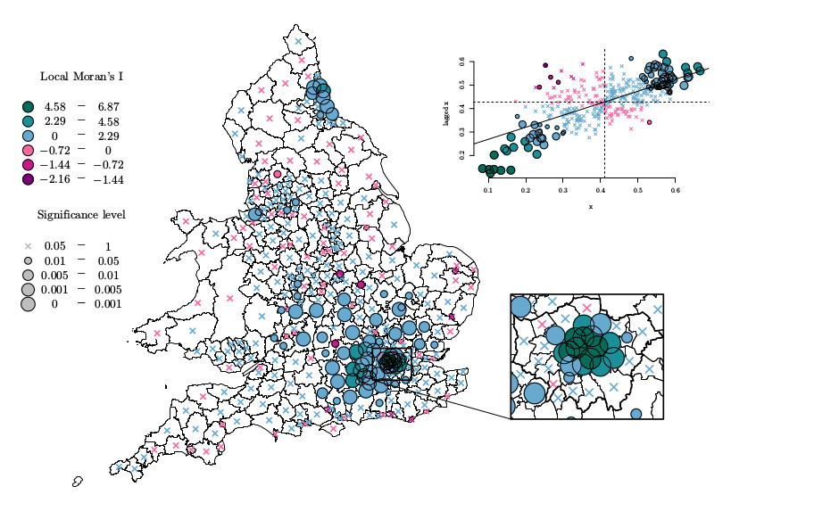

# Outline

* What exactly is R and why do we use it?

* The Rstudio way of interfacing with R

* The R language simplified

* A live demonstration of how to create a regression model using R

---

#  What exactly is R and why do we use it?

--

`1.`  R is a programming language

--

`2.`  R is an environment for data analysis 

--

R is one of the most popular platforms for data analysis, with an expanding user base as well as ever expanding funcitonality.

--

* Free, open source and available on all three major platforms

--

* Countless extensions (packages) and interfaces with other programmes

--

* Great community 

--

* Making reproducibile research the norm

--

* Excellent data visualisation capabilities

---
# Dataviz examples
### Lexis maps - Logged death rates 14 European countries 1900 -

```{r echo = FALSE}
knitr::include_graphics("figures/lexis.jpg")
```

---
# Dataviz examples
### Local Autocorrelation--UK census 2001

```{r echo = FALSE}
knitr::include_graphics("figures/lisa1.jpg")
```

---
# Dataviz examples
### Local Autocorrelation--UK census 2001

```{r echo = FALSE}

```

---
# Dataviz examples
### Stacked bar charts: Household living arrangements of older people

```{r, echo = FALSE, out.width = "700px"}
knitr::include_graphics("figures/botswana.jpg")
```

---
# Dataviz examples--animation
### Korea: Population pyramid

```{r echo = FALSE}
knitr::include_graphics("figures/pyramid_65_Republic_of_Korea_1980-2015.gif")
```
---
# Dataviz examples--animation
### Korea: Population pyramid

```{r echo = FALSE}
knitr::include_graphics("figures/pyramid_65_Republic_of_Korea_2015-2050.gif")
```
---
# Dataviz examples--interactivity

```{r, echo = FALSE, out.width = "700px"}
knitr::include_graphics("figures/vietnam.jpg")
```
[Interactive datavis solution using `shiny` in R](https://maja.shinyapps.io/VHLSS/)

---

# Dataviz examples--galleries

[https://www.r-graph-gallery.com/](https://www.r-graph-gallery.com/)


[https://shiny.rstudio.com/gallery/](https://shiny.rstudio.com/gallery/)

---

# Rstudio


* Difference between plain old R and Rstudio.

--

* Other IDEs (Integrated development environemnts)

--

* Rstudio layout:
  + console---command window
  + script window---editor
  + workspace & history window + more
  + files, plots, packages, help + more

---

# The R language simplified

## calculations

```{r}
19 + 3
(3 + 5) ^ 4 - 3/17*19
```
---

# The R language simplified
## variable assignment
```{r}
height <- 11
width <- 5
height
width
area <- height * width
area 
height <- 7
area
area <- height * width
area
```

---
# The R language simplified

### vectors and data types 

```{r}
# numeric vectors
vec1 <- c(20, 33, 41, 22, 12)
vec1
vec2 <- 1:5
vec2
vec1 + vec2
vec1 * 10
vec2 + 1000
```
---
# The R language simplified

### vectors and data types 
```{r}
# string  vectors
vec3 <- c("Maja", "Michael", "Amy", "Nabila", "Taylor")
vec3
# logical vectors 
vec4 <- c(TRUE, FALSE, FALSE, TRUE, TRUE)
vec4
```


---
# The R language simplified

### functions in base R

```{r}
# calculate the average
(3 + 1 + 5 + 2 + 5)/5
sum(vec1)/5
sum(vec1)/length(vec1)
mean(vec1)
```

---
# The R language simplified

### functions in base R

```{r}
# sample from normal distribution
rnorm(10)
rnorm(10, 5)
rnorm(10, 5, 100)
```

---
# The R language simplified

### functions written by us

```{r}
# user defined funcitons
sample(1:6, 1)
dice <- function(){sample(1:6, 1)}
dice()

dice.new <- function(sides){sample(1:sides, 1)}
dice.new(3)
dice.new(100)
```

---
# The R language simplified
### data frames

```{r}
vec5 <- c(1981, 1974, 1993, 1957, 1971)

data.frame(vec1, vec2, vec3, vec4, vec5)


```
---
# The R language simplified
### data frames

```{r}
vec5 <- c(1981, 1974, 1993, 1957, 1971)

my.df <- data.frame(id = vec2, 
                    year.born = vec5, 
                    name = vec3, 
                    rps = vec1,  
                    like.wc = vec4)
my.df

```

---
# The R language simplified - plots

```{r}
plot(my.df$rps)
```
---
# The R language simplified - plots

```{r}
hist(my.df$rps)
```
---
# Linear Regression Modelling in R

```{r}
# load data and explore
library(gapminder)
head(gapminder)
length(unique(gapminder$country))
min(gapminder$year)
max(gapminder$year)
```
---
# Linear Regression Modelling in R

```{r}
plot(jitter(gapminder$year), gapminder$lifeExp)
```
---
# Linear Regression Modelling in R

```{r}
reg1 <- lm(lifeExp ~ year, data = gapminder)

summary(reg1)

```

---
# Linear Regression Modelling in R

```{r, out.height = "450px"}
plot(jitter(gapminder$year), gapminder$lifeExp)
abline(reg1$coefficients, col = "red", lwd = 3)
```

---
# Linear Regression Modelling in R

```{r}
reg2 <- lm(lifeExp ~ gdpPercap, data = gapminder)
summary(reg2)
```

---
# Linear Regression Modelling in R

```{r, out.height = "450px"}
plot(gapminder$gdpPercap, gapminder$lifeExp)
abline(reg2$coefficients, col = "red", lwd = 3)
```

---
# Bivariate regression 2

```{r, out.height = "450px"}
reg3 <- lm(lifeExp ~ log(gdpPercap), data = gapminder)
summary(reg3)
```
---
## Bivariate regression with transformed variable

```{r, out.height = "450px"}
plot(log(gapminder$gdpPercap), gapminder$lifeExp)
abline(reg3$coefficients, col = "red", lwd = 3)
```

---
## Multiple regression

```{r}
reg4 <- lm(lifeExp ~ log(gdpPercap) + year, data = gapminder)
summary(reg4)
```

---
## Multiple regression with categorical variable

```{r}
gapminder.2007 <- subset(gapminder, year == 2007)
reg5 <- lm(lifeExp ~ log(gdpPercap)  + continent, data = gapminder.2007)
summary(reg5)
```
---
## Multiple regression with categorical variable

```{r, echo = FALSE}
coef <- reg5$coefficients

plot(log(gapminder.2007$gdpPercap), gapminder.2007$lifeExp, 
     col =gapminder.2007$continent, pch = 19)

abline(coef[1], coef[2], col = "black")
abline(coef[1]+ coef[3], coef[2], col = "red")
abline(coef[1]+ coef[4], coef[2], col = "green3")
abline(coef[1]+ coef[5], coef[2], col = "blue")
abline(coef[1]+ coef[6], coef[2], col = "cyan")

legend("topleft", legend = c("Africa", "Americas", "Asia", "Europe", "Oceania"),
       col = 1:5, pch = 19)
```
---
## Multiple regression with interaction term

```{r, echo = FALSE}
reg6 <- lm(lifeExp ~ log(gdpPercap) * continent, data = gapminder.2007)
summary(reg6)
```
---
## Multiple regression with interaction term

```{r, echo = FALSE}
plot(log(gapminder.2007$gdpPercap), gapminder.2007$lifeExp, 
     col = gapminder.2007$continent, pch = 19)

abline(reg6$coefficients[1], reg6$coefficients[2])
abline(reg6$coefficients[1] + reg6$coefficients[3], 
       reg6$coefficients[2] + reg6$coefficients[7], col = "green3")

abline(reg6$coefficients[1] + reg6$coefficients[4], 
       reg6$coefficients[2] + reg6$coefficients[8], col = "red")

abline(reg6$coefficients[1] + reg6$coefficients[5], 
       reg6$coefficients[2] + reg6$coefficients[9], col = "blue")

abline(reg6$coefficients[1] + reg6$coefficients[6], 
       reg6$coefficients[2] + reg6$coefficients[10], col = "cyan")

legend("topleft", legend = c("Africa", "Americas", "Asia", "Europe", "Oceania"),
       col = 1:5, pch = 19)
```

---

## Multiple regression with interaction term
```{r, echo = FALSE}
suppressMessages(library(effects))
interaction <- effect("log(gdpPercap) * continent", reg6)
plot(interaction, style = "line", multiline = TRUE)
```
